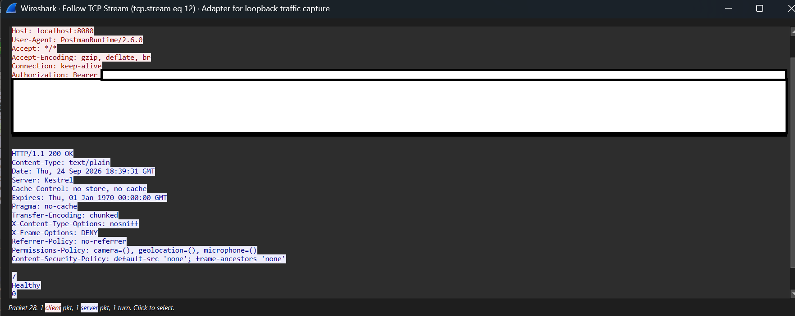

# Lab 01 — HTTP Traffic Analysis with Wireshark

## Overview

This lab analyzes network traffic generated between an HTTP client and my
[SecureBank](https://github.com/Bass-Ninja/SecureBank) ASP.NET Core API.

The goal is to connect networking concepts such as TCP connections, ports,
sequence numbers, acknowledgements, IPv6, and HTTP with traffic generated by
a real application.

The lab also demonstrates why sensitive application traffic should not be
transmitted over plaintext HTTP.

## Lab Environment

| Component | Purpose |
| --- | --- |
| Wireshark | Packet capture and protocol analysis |
| Postman | HTTP client |
| SecureBank API | ASP.NET Core Web API used as the target |
| Docker Desktop | Hosts the SecureBank services |
| Kestrel | HTTP server used by the ASP.NET Core API |

The SecureBank API was exposed locally on:

`http://localhost:8080`

The test request used:

`GET /health/ready`

Traffic was captured on the local loopback interface.

---

## 1. Capturing the Traffic

Wireshark was configured with the following display filter:

`tcp.port == 8080`

I then sent a request to the SecureBank API using Postman:

`GET http://localhost:8080/health/ready`

The capture showed communication over the IPv6 loopback address:

`::1`

Because both Postman and the Docker-exposed API were running on the same
machine, both the source and destination addresses appeared as `::1`.

---

## 2. TCP Connection Establishment

Before HTTP data could be exchanged, the client and server established a TCP
connection using the TCP three-way handshake.

| Direction | Flags | Seq | Ack |
| --- | --- | ---: | ---: |
| Client → Server | SYN | 0 | 0 |
| Server → Client | SYN, ACK | 0 | 1 |
| Client → Server | ACK | 1 | 1 |

### Captured Packet Sequence

The capture below shows the TCP three-way handshake followed by the HTTP
request, acknowledgement, response, and final acknowledgement.

The client used ephemeral port `29005`, while the SecureBank API was listening
on port `8080`.

The connection was therefore:

`[::1]:29005 → [::1]:8080`

The initial SYN consumes one sequence number. This explains why the server
acknowledged the client's `Seq=0` SYN with `Ack=1`.

After the final ACK, the TCP connection was established and application data
could be transmitted.

---

## 3. Analyzing the HTTP Request

After the TCP connection was established, Postman transmitted the HTTP request.

The TCP segment containing the request showed:

- Source port: `29005`
- Destination port: `8080`
- Sequence number: `1`
- Acknowledgement number: `1`
- TCP payload: `1514 bytes`

At the transport layer, TCP treats the HTTP request as a sequence of bytes.

Wireshark was then able to interpret those bytes as HTTP and display
application-layer information including:

- HTTP method and path
- Host
- User-Agent
- Accept headers
- Connection information
- Authorization header

The server acknowledged the request with:

`Ack=1515`

This can be calculated as:

`Seq 1 + 1514 bytes = Ack 1515`

The acknowledgement number represents the next byte the receiver expects.

---

## 4. Analyzing the HTTP Response

SecureBank returned an HTTP `200 OK` response.

The response contained:

- Source port: `8080`
- Destination port: `29005`
- Sequence number: `1`
- Acknowledgement number: `1515`
- TCP payload: `454 bytes`

The client subsequently acknowledged the response with:

`Ack=455`

Calculated as:

`Seq 1 + 454 bytes = Ack 455`

This demonstrates that TCP maintains an independent sequence space for each
direction of communication.

A useful mental model is:

> **Sequence number:** position in the data I am sending  
> **Acknowledgement number:** next byte I expect from the other side

---

## 5. Following the TCP Stream

Wireshark's **Follow TCP Stream** feature was used to reconstruct the
application-layer conversation.

Because the application was communicating over plaintext HTTP, the contents of
the request and response were directly visible.

This included:

- HTTP method and path
- Request headers
- Authorization header
- Bearer token
- Response headers
- Response body

No decryption was required.

### Reconstructed HTTP Stream

The reconstructed TCP stream shows that both the HTTP request and response
were readable directly from the captured traffic.

The request contained an `Authorization: Bearer` header. The bearer token
itself has been redacted before publication.

> **Note:** Authentication tokens and other sensitive values have been redacted
> from screenshots included in this repository.

---

## Security Finding — Sensitive Data Transmitted Over Plaintext HTTP

### Observation

During this lab, the SecureBank development API was configured to communicate
over plaintext HTTP.

Packet inspection demonstrated that application-layer data could be read
directly from captured traffic. In this test, that included an Authorization
header containing a bearer token.

### Security Impact

An observer capable of capturing plaintext HTTP traffic could potentially
access sensitive information transmitted between the client and server.

Depending on the request, this could include:

- Authentication tokens
- Credentials
- Account information
- Request bodies
- API responses

Authentication and transport encryption solve different security problems.

A valid bearer token can authenticate a request, but it does not protect that
token from observation while being transmitted over plaintext HTTP.

### Recommended Remediation

Client-facing application traffic should use HTTPS with TLS to provide
confidentiality and integrity protection for data in transit.

---

## OSI Model Mapping

The capture demonstrated communication across several layers of the network
stack:

| OSI Layer | Observed Protocol / Technology |
| --- | --- |
| Layer 7 — Application | HTTP / SecureBank API |
| Layer 4 — Transport | TCP |
| Layer 3 — Network | IPv6 (`::1`) |

At Layer 4, the HTTP request is TCP payload.

At Layer 7, the same data is interpreted as an HTTP request containing methods,
paths, headers, authorization information, and application data.

This demonstrates an important separation of responsibilities:

> **TCP provides reliable delivery of bytes. HTTP defines what those bytes mean
> to the application.**

---

## Key Takeaways

Through this lab I practiced:

- Capturing application traffic with Wireshark
- Filtering traffic by TCP port
- Identifying IPv6 loopback communication
- Distinguishing ephemeral client ports from server listening ports
- Analyzing the TCP three-way handshake
- Interpreting TCP sequence and acknowledgement numbers
- Inspecting HTTP requests and responses
- Reconstructing a conversation using Follow TCP Stream
- Identifying the security implications of plaintext HTTP
- Relating observed traffic to the OSI model

---

## Next Step — TLS

The next stage of this lab will configure SecureBank to use HTTPS/TLS.

The same API request will then be captured again and compared with the
plaintext HTTP capture.

The objective is to determine what information remains visible to a network
observer after transport encryption is enabled.
