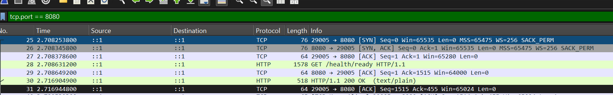
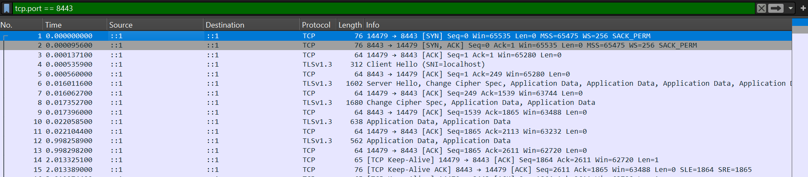
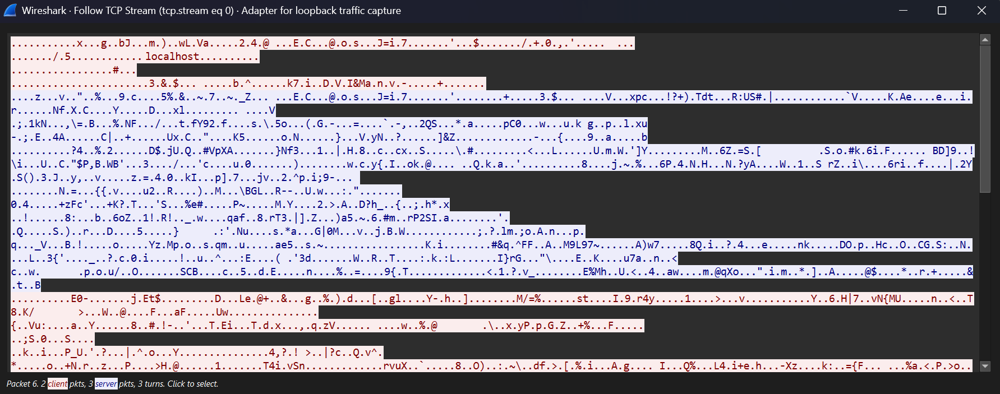

# Lab 01 — HTTP vs HTTPS Traffic Analysis with Wireshark

## Overview

This lab compares network traffic generated when my [SecureBank](https://github.com/Bass-Ninja/SecureBank) ASP.NET Core API communicates over plaintext HTTP and HTTPS protected by TLS.

The goal is to connect networking concepts such as TCP connections, ports, sequence numbers, acknowledgements, IPv6, HTTP, and TLS with traffic generated by a real application.

The experiment begins by deliberately exposing the API over plaintext HTTP in a controlled local environment. Packet capture is then used to demonstrate that application data, including an Authorization bearer token, can be observed directly.

TLS is subsequently enabled for the same API and the experiment is repeated to verify how HTTPS changes what is visible to a passive network observer.

## Lab Summary

**Objective:** Compare SecureBank API traffic over plaintext HTTP and HTTPS.

**Security observation:** Plaintext HTTP exposed the Authorization bearer token and other application-layer data to passive packet inspection.

**Remediation:** Enable HTTPS using TLS.

**Verification:** The experiment was repeated over HTTPS and the HTTP application data was no longer readable through passive packet capture.

**Technologies:** Wireshark, Postman, Docker, ASP.NET Core, Kestrel, TCP/IP, HTTP, TLS 1.3

## Lab Environment

| Component | Purpose |
| --- | --- |
| Wireshark | Packet capture and protocol analysis |
| Postman | HTTP/HTTPS client |
| SecureBank API | ASP.NET Core Web API used as the target |
| Docker Desktop | Hosts the SecureBank services |
| Kestrel | ASP.NET Core web server |
| .NET development certificate | Local TLS certificate |

The initial HTTP endpoint was:

```text
http://localhost:8080
```

HTTPS was later exposed on:

```text
https://localhost:8443
```

The same endpoint was used for both tests:

```http
GET /health/ready
```

Traffic was captured on the local loopback interface.

### Local Test Architecture

```text
Postman
   │
   │ HTTP :8080 / HTTPS :8443
   ▼
Host loopback (::1)
   │
   ▼
Docker port mapping
   │
   ▼
SecureBank container
   │
   ▼
Kestrel
```

---

# Part 1 — Plaintext HTTP

## 1. Capturing the HTTP Traffic

Wireshark was configured with the following display filter:

```text
tcp.port == 8080
```

I then sent a request to the SecureBank API using Postman:

```http
GET http://localhost:8080/health/ready
```

The capture showed communication over the IPv6 loopback address:

```text
::1
```

Because both Postman and the Docker-exposed API were running on the same machine, both the source and destination addresses appeared as `::1`.

---

## 2. TCP Connection Establishment

Before HTTP data could be exchanged, the client and server established a TCP connection using the TCP three-way handshake.

| Direction | Flags | Seq | Ack |
| --- | --- | ---: | ---: |
| Client → Server | SYN | 0 | 0 |
| Server → Client | SYN, ACK | 0 | 1 |
| Client → Server | ACK | 1 | 1 |

### Captured Packet Sequence

The capture below shows the TCP three-way handshake followed by the HTTP request, acknowledgement, response, and final acknowledgement.



The client used ephemeral port `29005`, while the SecureBank API was listening on port `8080`.

The connection was therefore:

```text
[::1]:29005 → [::1]:8080
```

The initial SYN consumes one sequence number. This explains why the server acknowledged the client's `Seq=0` SYN with `Ack=1`.

After the final ACK, the TCP connection was established and application data could be transmitted.

---

## 3. Analyzing the HTTP Request

After the TCP connection was established, Postman transmitted the HTTP request.

The TCP segment containing the request showed:

- Source port: `29005`
- Destination port: `8080`
- Sequence number: `1`
- Acknowledgement number: `1`
- TCP payload: `1514 bytes`

At the transport layer, TCP treats the HTTP request as a sequence of bytes.

Wireshark was then able to interpret those bytes as HTTP and display application-layer information including:

- HTTP method and path
- Host
- User-Agent
- Accept headers
- Connection information
- Authorization header

The server acknowledged the request with:

```text
Ack=1515
```

Calculated as:

```text
Seq 1 + 1514 bytes = Ack 1515
```

The acknowledgement number represents the next byte the receiver expects.

---

## 4. Analyzing the HTTP Response

SecureBank returned an HTTP `200 OK` response.

The response contained:

- Source port: `8080`
- Destination port: `29005`
- Sequence number: `1`
- Acknowledgement number: `1515`
- TCP payload: `454 bytes`

The client subsequently acknowledged the response with:

```text
Ack=455
```

Calculated as:

```text
Seq 1 + 454 bytes = Ack 455
```

This demonstrates that TCP maintains an independent sequence space for each direction of communication.

A useful mental model is:

> **Sequence number:** position in the data I am sending  
> **Acknowledgement number:** next byte I expect from the other side

---

## 5. Following the Plaintext TCP Stream

Wireshark's **Follow TCP Stream** feature was used to reconstruct the application-layer conversation.

Because the application was communicating over plaintext HTTP, the contents of the request and response were directly visible.

This included:

- HTTP method and path
- Request headers
- Authorization header
- Bearer token
- Response headers
- Response body

No decryption was required.

### Reconstructed HTTP Stream

The reconstructed TCP stream shows that both the HTTP request and response were readable directly from the captured traffic.

The request contained an `Authorization: Bearer` header. The bearer token itself has been redacted before publication.


> **Note:** Authentication tokens and other sensitive values have been redacted from screenshots included in this repository.

---

## Security Observation — Sensitive Data Exposure Over Plaintext HTTP

### Observation

During the first stage of this controlled experiment, the SecureBank development API was deliberately configured to communicate over plaintext HTTP.

Packet inspection demonstrated that application-layer data could be read directly from captured traffic.

In this test, that included an Authorization header containing a bearer token.

### Security Impact

An observer capable of capturing plaintext HTTP traffic could potentially access sensitive information transmitted between the client and server.

Depending on the request, this could include:

- Authentication tokens
- Credentials
- Account information
- Request bodies
- API responses

Authentication and transport encryption solve different security problems.

A valid bearer token can authenticate a request, but it does not protect that token from observation while being transmitted over plaintext HTTP.

### Recommended Remediation

Client-facing application traffic should use HTTPS with TLS to provide confidentiality and integrity protection for data in transit.

---

# Part 2 — TLS Remediation and Verification

## 6. Enabling HTTPS

To test the recommended remediation, HTTPS was added to the SecureBank development environment.

The existing HTTP endpoint was retained temporarily to allow a controlled comparison between HTTP and HTTPS.

The resulting Kestrel configuration exposed:

| Protocol | Endpoint |
| --- | --- |
| HTTP | `http://localhost:8080` |
| HTTPS | `https://localhost:8443` |

A trusted .NET development certificate for `localhost` was exported as a PFX file and mounted read-only into the SecureBank API container.

The certificate itself was stored outside the source repository, while its password was supplied to Docker through an environment variable rather than being committed to source control.

This allowed Kestrel inside the Linux container to establish TLS connections while keeping the certificate's private key and password out of the repository.

---

## 7. Capturing the HTTPS Traffic

A new Wireshark capture was started and filtered using:

```text
tcp.port == 8443
```

The same API request was then sent using HTTPS:

```http
GET https://localhost:8443/health/ready
```

The request contained the same type of Authorization bearer token used during the HTTP test.

The TCP three-way handshake was still visible because TLS operates on top of the TCP connection.

However, after the TCP connection was established, a TLS handshake occurred before application data was exchanged.

### Captured TLS Packet Sequence



The observed sequence was approximately:

1. TCP SYN
2. TCP SYN/ACK
3. TCP ACK
4. TLS Client Hello
5. TLS Server Hello and subsequent TLS handshake traffic
6. TLS Application Data

Unlike the plaintext capture, Wireshark no longer displayed an HTTP `GET /health/ready` request or HTTP `200 OK` response directly in the packet list.

---

## 8. TLS Handshake Analysis

### Client Hello

The TLS Client Hello advertised the cryptographic capabilities supported by the client.

The capture included:

- TLS 1.3 in the Supported Versions extension
- 18 offered cipher suites
- Server Name Indication (SNI): `localhost`

The Client Hello also contained a legacy version field identifying TLS 1.2.

For TLS 1.3 connections, this field exists for compatibility with older implementations. The Supported Versions extension indicates the versions actually offered by the client.

### Server Hello

The SecureBank server selected:

| Parameter | Negotiated Value |
| --- | --- |
| TLS version | TLS 1.3 |
| Cipher suite | `TLS_AES_256_GCM_SHA384` |
| Key exchange group | `X25519` |

The selected cipher suite uses AES-256-GCM for authenticated encryption.

X25519 is used during key agreement rather than directly encrypting the HTTP request. TLS uses the resulting shared secret material to derive symmetric session keys used to protect subsequent communication.

After the Server Hello, much of the remaining TLS 1.3 handshake and application traffic appeared as encrypted TLS records.

---

## 9. Inspecting the Encrypted TCP Stream

The HTTPS connection was then inspected using Wireshark's **Follow TCP Stream** feature.

Unlike the HTTP capture, the TCP stream no longer contained readable HTTP application data.



The following information that had been directly visible during the HTTP test was no longer readable:

- `GET /health/ready`
- Authorization header
- Bearer token
- HTTP response headers
- `200 OK`
- Response body (`Healthy`)

Instead, the TCP stream contained TLS records and encrypted application data.

Attempting to follow the TLS stream did not reveal the HTTP contents because Wireshark had not been provided with the TLS session secrets required to decrypt the connection.

> TLS traffic can be decrypted in a controlled debugging environment if the appropriate session secrets are deliberately provided to Wireshark. This experiment demonstrates that passive packet capture alone did not expose the HTTP application data.

---

## 10. What TLS Still Exposed

TLS protected the application-layer contents, but it did not make the network connection invisible.

Wireshark could still observe information including:

- Source and destination IP addresses
- Source and destination TCP ports
- Packet sizes
- Packet timing
- TCP connection establishment
- TLS handshake traffic
- Negotiated TLS version
- Negotiated cipher suite
- SNI (`localhost`) in this capture

This demonstrates the difference between encrypting application data and concealing network metadata.

---

## 11. HTTP vs HTTPS Comparison

| Observation | HTTP | HTTPS |
| --- | --- | --- |
| TCP handshake visible | Yes | Yes |
| HTTP method/path readable | Yes | No |
| HTTP headers readable | Yes | No |
| Authorization header readable | Yes | No |
| Bearer token readable | Yes | No |
| HTTP response readable | Yes | No |
| Response body readable | Yes | No |
| TLS handshake visible | No | Yes |
| Packet sizes/timing visible | Yes | Yes |
| Application payload protected | No | Yes |

The comparison demonstrates that authentication alone does not protect application data in transit.

With plaintext HTTP, the bearer token could be observed directly in the packet capture.

After enabling TLS, the same application data was transmitted as encrypted TLS application data and was no longer readable through passive packet inspection.

---

## 12. Verification

The remediation was verified by repeating the original experiment under the same general conditions while changing the transport from HTTP to HTTPS.

The HTTPS capture was inspected for values that had previously been visible, including:

- `Bearer`
- `/health/ready`
- `Healthy`

These application values were no longer available as readable plaintext in the captured TLS application traffic.

The connection successfully negotiated TLS 1.3 using:

```text
TLS_AES_256_GCM_SHA384
```

with X25519 for key agreement.

The result confirms that the HTTPS endpoint protected the HTTP application contents from passive observation in this experiment.

---

## OSI Model Mapping

The experiment demonstrated communication across several layers of the network stack:

| OSI Layer | Observed Protocol / Technology |
| --- | --- |
| Layer 7 — Application | HTTP / SecureBank API |
| Between application and transport | TLS |
| Layer 4 — Transport | TCP |
| Layer 3 — Network | IPv6 (`::1`) |

TLS does not map perfectly to a single OSI layer. In this experiment it can be understood as protecting application data before that data is transported over TCP.

At the TCP layer, application communication is transported as bytes.

With plaintext HTTP, Wireshark could directly interpret those bytes as HTTP.

With HTTPS, HTTP application data was protected by TLS before being carried over TCP, preventing the passive capture from exposing the HTTP contents.

> **TCP provides reliable delivery of bytes. HTTP defines what those bytes mean to the application. TLS protects those application bytes while they are in transit.**

---

## Key Takeaways

Through this lab I practiced:

- Capturing local application traffic with Wireshark
- Filtering traffic by TCP port
- Identifying IPv6 loopback communication
- Distinguishing ephemeral client ports from server listening ports
- Analyzing the TCP three-way handshake
- Interpreting TCP sequence and acknowledgement numbers
- Inspecting plaintext HTTP requests and responses
- Reconstructing communication using Follow TCP Stream
- Identifying sensitive information exposed over plaintext HTTP
- Configuring HTTPS for a Dockerized ASP.NET Core API
- Working with local development certificates
- Analyzing a TLS 1.3 Client Hello and Server Hello
- Identifying the negotiated cipher suite and key exchange group
- Comparing plaintext HTTP with encrypted TLS application traffic
- Understanding which network metadata remains observable under TLS
- Verifying a security remediation through packet analysis

---

## Conclusion

The initial controlled packet capture demonstrated that plaintext HTTP exposed the SecureBank request and response contents, including an Authorization bearer token.

HTTPS was then enabled and the experiment was repeated using the same API endpoint.

The resulting connection negotiated TLS 1.3 using `TLS_AES_256_GCM_SHA384` with X25519 for key agreement.

Wireshark could still observe the TCP connection and TLS metadata, but the HTTP request, Authorization header, bearer token, and response contents were no longer readable through passive packet capture.

This lab demonstrates the practical distinction between authentication and transport security and shows how packet analysis can be used not only to identify a security weakness, but also to verify that a remediation is working as intended.